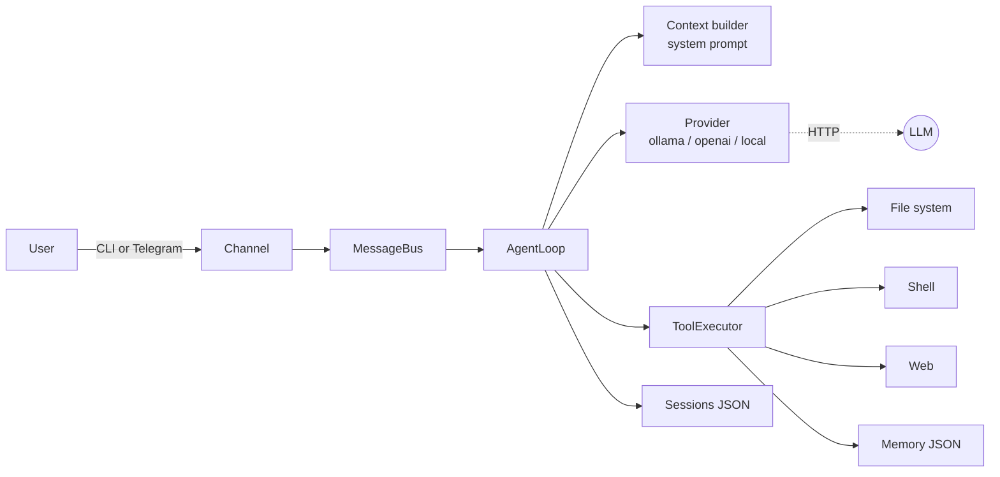
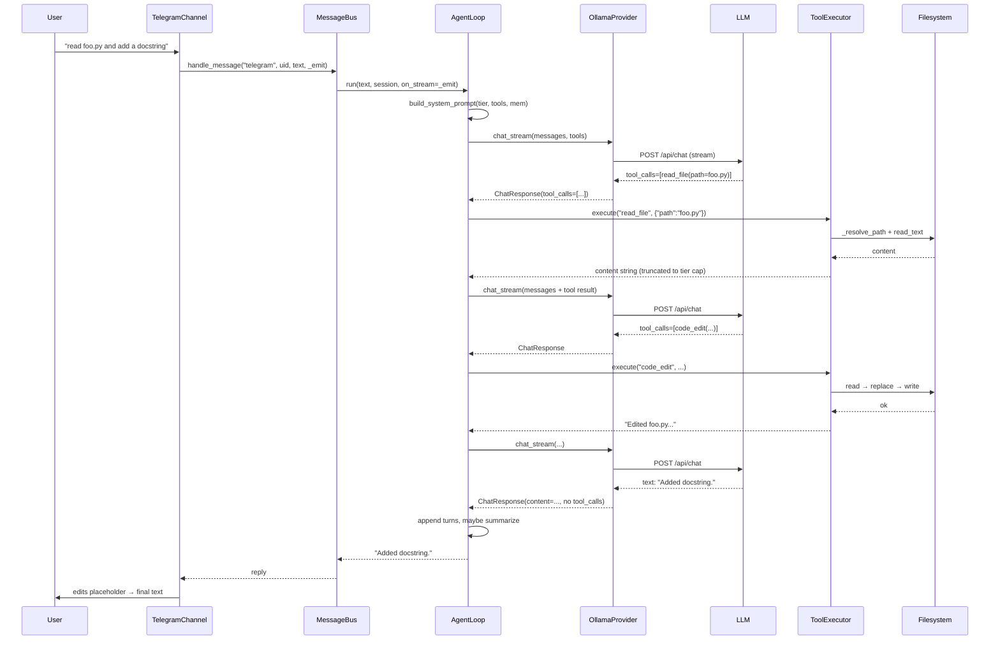

# Agent Mini — Technical Implementation

A deep dive into how Agent Mini is built. The whole codebase is ~3,000 lines of Python, no frameworks (LangChain, LiteLLM, etc.), just `httpx` + `asyncio` + `click` + `rich`. This document explains the moving parts and the design decisions behind each one.

---

## 1. High-Level Architecture

Agent Mini is a **ReAct-style loop** — the LLM thinks, picks a tool, observes the result, and repeats until it returns a text answer. Around that loop we have:

- **Providers** — pluggable LLM backends (Ollama, OpenAI, any OpenAI-compatible server).
- **Tools** — shell, files, web, memory. Extensible via plugin drop-ins.
- **Channels** — how the user talks to the agent (CLI REPL, Telegram).
- **Bus** — routes a `(channel, user_id)` pair to its own conversation history.
- **Sessions** — JSON-backed conversation persistence, auto-saved every turn.
- **Config / Memory** — JSON files under `~/.agent-mini/`.



Source map:

- Loop and prompt: [src/agent_mini/agent/loop.py](../src/agent_mini/agent/loop.py), [src/agent_mini/agent/context.py](../src/agent_mini/agent/context.py)
- Tools: [src/agent_mini/agent/tools.py](../src/agent_mini/agent/tools.py)
- Providers: [src/agent_mini/providers/base.py](../src/agent_mini/providers/base.py), [ollama.py](../src/agent_mini/providers/ollama.py), [local.py](../src/agent_mini/providers/local.py), [openai.py](../src/agent_mini/providers/openai.py)
- Channels: [src/agent_mini/channels/telegram.py](../src/agent_mini/channels/telegram.py)
- Bus + sessions: [src/agent_mini/bus.py](../src/agent_mini/bus.py), [src/agent_mini/sessions.py](../src/agent_mini/sessions.py)
- CLI: [src/agent_mini/cli.py](../src/agent_mini/cli.py)
- Config: [src/agent_mini/config.py](../src/agent_mini/config.py)
- Memory: [src/agent_mini/agent/memory.py](../src/agent_mini/agent/memory.py)
- Vision: [src/agent_mini/agent/vision.py](../src/agent_mini/agent/vision.py)
- Model tiers / token estimator: [src/agent_mini/agent/token_estimator.py](../src/agent_mini/agent/token_estimator.py)

---

## 2. Startup & Wiring

The `agent-mini` command is a Click group defined in [src/agent_mini/cli.py](../src/agent_mini/cli.py). Sub-commands:

| Command | What it does |
|---|---|
| `init` | Interactive wizard → writes `~/.agent-mini/config.json` |
| `chat [-m MSG] [-s SESSION] [--workspace DIR]` | Single-shot or REPL |
| `gateway` | Starts the Telegram bot |
| `status` | Prints active provider, channels, sandbox, memory |

The chat command wires everything together in `_chat()`:

```
load_config → create_provider → Memory(...) → AgentLoop(provider, config, memory)
             → resume/create session → REPL loop → agent.run(...) → save_session(...)
```

The `--workspace` flag (and `AGENT_MINI_WORKSPACE` env var) overrides `config["workspace"]` and forces `restrictToWorkspace: true`. This is what the [evals harness](../evals/README.md) uses to sandbox each task into a temp dir without touching the user's real config.

---

## 3. The Agent Loop

Everything runs through `AgentLoop.run()` in [loop.py](../src/agent_mini/agent/loop.py).

### 3.1 Per-turn flow

1. Rebuild the system prompt every turn (date, workspace, recent memories, model tier are all live).
2. Prepend system prompt to the persisted `conversation`, append the new user turn.
3. If the user message contains image references (paths or URLs), the user turn becomes an OpenAI-style multi-part `content` list — see [vision.py](../src/agent_mini/agent/vision.py).
4. Enter an iteration budget (default from tier; user override in `config["agent"]["maxIterations"]`).

Inside each iteration:

```
prune old tool results  →  call provider (with retry+jitter)
                       →  if response has tool_calls: exec in parallel, append tool msgs, continue
                       →  else: return text, persist turn, maybe summarize history, done
```

Relevant code: [loop.py L92-L235](../src/agent_mini/agent/loop.py#L92-L235).

### 3.2 Retry with jitter

`_call_provider_with_retry` retries on transient errors (HTTP 429/500/502/503/504, `ConnectError`, `ReadTimeout`, `OSError`) up to 3 times with exponential backoff plus random jitter: `wait = 2**attempt + random.uniform(0, 1)`. Non-transient errors fail through as an error string. See [loop.py L306-L336](../src/agent_mini/agent/loop.py#L306-L336).

### 3.3 Parallel tool execution

When the LLM returns multiple tool calls in one response, they're dispatched concurrently with `asyncio.gather`, tagged with `tool_call_id`, and appended in order:

```python
results = await asyncio.gather(*[_exec(tc) for tc in response.tool_calls])
```

Each result is truncated to the **tier-specific output limit** (tiny 2 KB, small 4 KB, medium 8 KB, cloud 50 KB) with a head+tail split so the model sees both ends. If a tool returned `Error: ...`, the message is postfixed with a self-reflection nudge:

> [The tool call failed. Analyze what went wrong and try a different approach.]

### 3.4 Loop / repetition detection

Every tool call is hashed with MD5 over `{name, args}` and pushed onto a sliding window of the last 6 signatures. If the last **four** are identical, a synthetic `user` message is appended:

> You have repeated the same tool call multiple times with the same result. Try a completely different approach.

This catches small models that get stuck retrying the same failing shell command. See [loop.py L213-L227](../src/agent_mini/agent/loop.py#L213-L227).

### 3.5 Context pruning

`_prune_tool_results` is called every iteration on a **copy** of `messages` (never mutates history). It:

- protects the last 3 assistant turns and their tool results,
- soft-trims older large tool messages to head 1500 + tail 1500,
- hard-clears very old ones with `[Old tool result cleared to save context]`.

This keeps the request payload small without losing recent reasoning steps.

### 3.6 History summarization

After a text-only response, if the persisted conversation exceeds 75% of the model's effective context, `_summarize_history` fires. It:

1. Finds the cut point that would bring us back below 50%.
2. Calls the provider with a tight summarization prompt (`temperature=0.3`, no tools).
3. Replaces the pruned tail with a single **`role: "user"`** turn containing `[Previous context summary]\n...`.

Why `user`, not `system`? The real system prompt is re-prepended fresh every turn in `run()`, so a stored `system` entry would give small models two leading system messages and dilute the constraint-first anchoring they rely on. See [loop.py L268-L304](../src/agent_mini/agent/loop.py#L268-L304).

### 3.7 Token / cost tracking

Two counters live on the loop: `session_usage` and per-turn `turn_usage`, both `{prompt_tokens, completion_tokens, total_tokens}`. Providers surface `usage` on `ChatResponse` when the backend reports it (Ollama's `prompt_eval_count`/`eval_count`; OpenAI's `usage`).

---

## 4. Model-Tier-Aware Tuning

[token_estimator.py](../src/agent_mini/agent/token_estimator.py) is the small-model spine of the project. Model name → tier → different behavior everywhere.

### 4.1 Classification

Regex patterns match from most-specific to least. Cloud models (`gpt-4`, `claude`, `gemini`, `deepseek-v2/v3`) win first, then large open-weight sizes (32B, 34B, 40B, 65B, 70B, 72B, 8x7B, 8x22B) also map to `cloud`. The `(?<![\d.])` lookbehind is important — it prevents `1.5b` (a tiny model) matching the `5b` in the small-tier regex.

| Tier | Effective context | Max iterations | Tool output cap |
|---|---|---|---|
| tiny (1–3B) | 3 000 | 10 | 2 000 chars |
| small (4–8B) | 6 000 | 15 | 4 000 chars |
| medium (9–14B) | 12 000 | 20 | 8 000 chars |
| cloud / large open-weight | 32 000 | 25 | 50 000 chars |

### 4.2 What changes per tier

- **System prompt** (`context.py`): tiny models get a stripped `_TINY_RULES` block instead of the full `_SYSTEM_PROMPT_TEMPLATE` — every token trades against reasoning budget.
- **Memory recall in prompt**: tiny=0, small=3, medium=5, cloud=5 recent memories. Tiny models get confused by unrelated context.
- **Inline tool listing**: an `<available_tools>` block is always emitted so small models can eyeball tool names without reasoning over the JSON schema.
- **Max iterations, context budget, output cap**: all pulled from the tier tables above unless the user pins a value in config.

### 4.3 Token estimation

Cheap: `~4 chars per token`. Vision image parts count as ~85 tokens each. Tool-call arguments are counted separately. Precise enough to drive the 75% / 50% summarization thresholds.

---

## 5. System Prompt Construction

[context.py](../src/agent_mini/agent/context.py):

```
[tier-scaled preamble + rules]
[<available_tools> ... </available_tools>]
[## User instructions   <- from config.agent.systemPrompt]
[## Recent memories     <- top-N by tier]
```

Two anti-injection details worth noting:

- The template uses `str.format(date=..., workspace=...)` — user-controlled fields never go through `.format()`. Custom `systemPrompt` and memory values are string-concatenated, so a stray `{}` from the user won't blow up formatting.
- Memory content is appended raw — treat it as effectively user-provided when auditing.

---

## 6. Providers

### 6.1 The abstraction

[providers/base.py](../src/agent_mini/providers/base.py) defines:

```python
@dataclass
class ToolCall:  id: str; name: str; arguments: dict

@dataclass
class ChatResponse:  content, tool_calls, thinking, usage

class BaseProvider(ABC):
    async def chat(messages, tools, temperature) -> ChatResponse
    async def chat_stream(messages, on_delta, tools, temperature, on_thinking) -> ChatResponse
```

Providers normalize to `ChatResponse`; the loop is provider-agnostic.

### 6.2 JSON repair for tool arguments

Small models emit malformed JSON. `parse_arguments` first tries `json.loads`, then `_repair_json` which:

1. Strips ``` fences.
2. Drops trailing commas before `}` / `]`.
3. Swaps single→double quotes when there are no doubles.
4. Quotes unquoted keys (`{foo: 1}` → `{"foo": 1}`).

Only successful `dict` results are returned; anything else logs a warning and drops the call. See [providers/base.py L37-L88](../src/agent_mini/providers/base.py#L37-L88).

### 6.3 Ollama

[ollama.py](../src/agent_mini/providers/ollama.py) — POSTs to `/api/chat`. Streams NDJSON.

Notable transforms in `_clean_messages`:

- `role: "tool"` messages are rewritten to `role: "user"` with a `[Tool result for ...]:` prefix, for compatibility with older Ollama builds that don't fully speak the tool-role protocol.
- OpenAI-style multi-part vision content (`[{type: "image_url", ...}]`) is flattened to Ollama's `{content, images: ["<base64>"]}` shape, stripping `data:...;base64,` prefixes when present.
- `think` (`false | true | "low" | "medium" | "high"`) is passed through unchanged; thinking deltas are streamed via a separate `on_thinking` callback.

### 6.4 OpenAI-compatible (`LocalProvider`)

[local.py](../src/agent_mini/providers/local.py) — plain `/chat/completions` client. Two subtleties:

- Streaming tool calls arrive in fragments indexed by `tc["index"]`. We accumulate them in a dict, then sort by that **integer** index — not by `id` (opaque string) which would sort `"call_10"` before `"call_2"` lexicographically.
- Arguments arrive as string fragments concatenated across chunks; we run the full string through `parse_arguments` (repair-aware) at the end.

### 6.5 OpenAI

[openai.py](../src/agent_mini/providers/openai.py) is a 20-line subclass of `LocalProvider` with `base_url = https://api.openai.com/v1` and `name = "openai"`. That's the whole thing — OpenAI *is* the reference implementation of its own protocol.

---

## 7. Tools

All in [tools.py](../src/agent_mini/agent/tools.py). Tool definitions use the OpenAI function-calling JSON shape:

```python
{"type": "function", "function": {"name": ..., "description": ..., "parameters": {...}}}
```

### 7.1 Built-in tools

Registered in `_CORE_TOOLS` and `_WEB_TOOLS`:

| Tool | Notes |
|---|---|
| `shell_exec` | Runs via `asyncio.create_subprocess_shell` inside workspace `cwd`, 120 s timeout, output capped at 50 KB. Blocklist regex enforced. |
| `read_file` / `write_file` / `append_file` / `code_edit` | Text I/O. `code_edit` requires **exact single-match** find-and-replace and returns a specific error for 0 or >1 matches so the model can adjust. `read_file` caps content at 100 KB. |
| `list_directory` | Sorted, directories first, capped at 200 entries. |
| `search_files` | Prefers `rg` (ripgrep) with `--hidden --glob '!.git'`; falls back to `grep -rn`. Output capped at 100 KB. `returncode` 0 or 1 both count as success (1 = no matches). |
| `web_search` | POSTs to `https://html.duckduckgo.com/html/`; parses result blocks with regex; unwraps DuckDuckGo redirect `uddg` param; returns top 8 as Markdown. |
| `web_fetch` | SSRF-guarded, HTML → plain text via a stdlib `HTMLParser` subclass. |
| `memory_store` / `memory_recall` | See section 8. |

### 7.2 SSRF guard

`_check_url_ssrf` enforces:

- scheme in `{http, https}`,
- literal IPs must not be private/loopback/link-local/reserved,
- host names are resolved via `getaddrinfo` and every returned `A`/`AAAA` record is checked — catches DNS names pointing into RFC-1918.

After the request, the **final** URL (post-redirect) is re-checked so an attacker can't 302 into `169.254.169.254`. Documented caveat: DNS rebinding can still bypass — `sandboxLevel: readonly` is the stronger guarantee.

### 7.3 Shell command blocklist

Default patterns:

```
\brm\s+-[^\s]*r[^\s]*f     rm -rf variants
\bsudo\b                    privilege escalation
\bmkfs\b                    filesystem format
\bdd\s+if=                  raw disk write
:\(\)\s*\{                  fork bomb
\b(chmod|chown)\s+...\s+/$  root permission change
```

`tools.blockedCommands` extends (not replaces) the defaults. README calls this out honestly: **friction, not a boundary** — a determined shell caller can bypass. Don't run the agent against untrusted input and expect the blocklist to save you.

### 7.4 Sandbox levels

`config.tools.sandboxLevel`:

- `unrestricted` — all tools, all paths.
- `workspace` (default) — all tools, but `_resolve_path` refuses anything outside `config.workspace`.
- `readonly` — hard-blocks `shell_exec`, `write_file`, `append_file`, `code_edit` at the `execute()` gate. Read, search, memory, and web tools still work.

Path resolution: `_resolve_path` expands `~`, resolves absolute paths, joins relative paths to the workspace, and in restricted mode raises `PermissionError` if the resolved path is not `is_relative_to(workspace)`. The tool exception handler catches this and returns `Error: PermissionError: ...` to the model.

### 7.5 Plugins

`_load_plugins()` scans `~/.agent-mini/plugins/*.py`, `importlib.util.spec_from_file_location` each one, and looks for a `TOOL_DEF` dict and `handler` callable (sync or async — the executor `await`s it if it's a coroutine). Plugin definitions get concatenated onto `get_tool_defs()` and dispatched from the `_` case of the `execute()` match.

```python
# ~/.agent-mini/plugins/timestamp.py
TOOL_DEF = {
    "type": "function",
    "function": {
        "name": "get_timestamp",
        "description": "Get current UTC timestamp.",
        "parameters": {"type": "object", "properties": {}, "required": []},
    },
}
async def handler(arguments: dict) -> str:
    from datetime import datetime, timezone
    return datetime.now(timezone.utc).isoformat()
```

No registration, no manifest — drop the file, restart the agent.

---

## 8. Persistent Memory

[memory.py](../src/agent_mini/agent/memory.py) — a JSON file at `~/.agent-mini/memory.json`, list of `{key, value, timestamp}`.

### 8.1 Storage

`store()` appends a dict, trims to `maxEntries` from the tail, and rewrites the file. Corrupted JSON → warn, start fresh (never fatal).

### 8.2 Recall — hand-rolled TF-IDF

No embeddings, no vector DB. `recall(query)` does:

1. **Tokenize + stem** — regex `[a-z0-9]+`, then a compact Porter-style suffix stripper that catches common inflections (`-ing`, `-ment`, `-ness`, `-ies`→`y`, `-es`, `-ed`, `-ly`, `-s`, plus ~15 more complex rules like `-ational` → `-ate`).
2. **IDF**: `log((N+1)/(df+1)) + 1` per query term.
3. **Score each doc**: sum of `(tf/doc_len) * idf` for exact term hits, plus a substring-fallback bonus of `0.3 * idf/doc_len` for partial matches (so `python` matches `pythonic`).
4. Return top 10 sorted by score, formatted as `[timestamp] key: value`.

That's it — no external deps, works fine for the hundreds-of-entries scale a personal agent hits.

### 8.3 Prompt integration

`Memory.get_recent(n)` returns the tail of the store; the context builder inlines them into the system prompt under `## Recent memories` (0/3/5/5 by tier). Manual recall via the `memory_recall` tool is the fuzzy-search path.

---

## 9. Sessions

[sessions.py](../src/agent_mini/sessions.py) — JSON files at `~/.agent-mini/sessions/<id>.json`:

```json
{
  "id": "20260728_143022",
  "updated": "2026-07-28T14:30:22.123456",
  "metadata": {},
  "conversation": [ ...role/content dicts... ]
}
```

`save_session` is called after every REPL turn (see `_chat` in cli.py). IDs default to `YYYYMMDD_HHMMSS`. `list_sessions` returns all files sorted newest-first with a computed preview of the first user message. `/load <id>` mutates the in-memory `conversation` list; `/save` exports the conversation to Markdown (renders tool calls / results in collapsible `<details>` blocks).

---

## 10. Channels & Bus

### 10.1 MessageBus

[bus.py](../src/agent_mini/bus.py) is thin. It maintains an in-memory dict keyed by `f"{channel}:{user_id}"` mapping to the conversation list, and calls `agent.run()`. This is what isolates two Telegram users from each other, or the CLI from the bot.

### 10.2 Telegram channel

[telegram.py](../src/agent_mini/channels/telegram.py) uses `python-telegram-bot ≥ 21`. Highlights:

- **Allowlist**: `allowFrom` is a set of user IDs or usernames; `"*"` disables the check.
- **Typing indicator** via `send_action("typing")` at the start of each message.
- **Streaming**: sends an initial `"..."` placeholder and edits it in place. `_flush` debounces edits (min 0.7 s between updates unless ≥80 new chars). It also short-circuits when the preview is unchanged, avoiding Telegram's `message is not modified` error.
- **Chunking**: replies longer than 4 000 chars are split (Telegram's message limit is 4 096).

`agent-mini gateway` iterates over enabled channels and calls `start(bus.handle_message)`. Currently only Telegram is implemented, but the `BaseChannel` interface makes adding new ones cheap.

---

## 11. Vision

[vision.py](../src/agent_mini/agent/vision.py) scans the user message for words that look like image paths (`.png/.jpg/.jpeg/.gif/.webp/.bmp`) or `https?://…\.png` URLs. If any are found, the user message becomes an OpenAI-style multi-part list:

```python
[
  {"type": "text", "text": "what is in this image?"},
  {"type": "image_url", "image_url": {"url": "data:image/png;base64,..."}}
]
```

- Local files are base64-encoded with the correct MIME type.
- Remote URLs are passed through unmodified.
- The Ollama provider translates this shape into its native `{content, images: [...]}` in `_clean_messages`, so the same message works on all three providers.

---

## 12. Configuration

[config.py](../src/agent_mini/config.py) mirrors the JSON config as typed dataclasses (`AppConfig`, `ProvidersConfig`, `AgentConfig`, `ToolsConfig`, etc.). The `AppConfig.from_dict` helper does key-filtered construction with `_pick`, so unknown keys in the JSON don't blow up instantiation — forward-compatible reads.

Key paths (all under `~/.agent-mini/` by default):

| Path | Purpose |
|---|---|
| `config.json` | User config |
| `workspace/` | Default tool sandbox root |
| `memory.json` | Persistent memory store |
| `plugins/*.py` | User tool plugins |
| `sessions/*.json` | Saved conversations |

Runtime overrides: `--workspace <dir>` and `AGENT_MINI_WORKSPACE` env var (used by the evals runner to isolate each task).

---

## 13. Evals Harness

[evals/](../evals/) is a framework-free task runner. Each YAML task under `evals/tasks/` describes:

- fixtures to copy into a temp workspace,
- a prompt to send to the agent,
- success predicates (file exists, `pytest` passes, regex in output, etc.),
- caps on iterations / tokens.

`evals/run.py` invokes the same `AgentLoop` with `AGENT_MINI_WORKSPACE` pointing at that temp dir, records success/iterations/tokens/tool-call counts, and writes a JSON report under `evals/results/`. `--compare results/*.json` prints a cross-model table. This is what lets tier-scaling changes be measured rather than intuited.

---

## 14. Error Handling & Observability

- **Provider errors**: transient → retry with jitter; permanent → the loop returns `f"Error communicating with LLM: {e}"` as the final text (still gets saved to conversation).
- **Tool errors**: caught in `execute()`, returned as `Error: {type}: {msg}`. The loop postfixes the self-reflection nudge so the model retries with a different approach.
- **Max iteration exhaustion**: the user turn is still appended with an assistant message `[Stopped: reached max iterations without completing.]` — so the next turn doesn't have amnesia about what happened.
- **Logging**: `logging.getLogger("agent-mini")`. `-v/--verbose` on `chat` / `gateway` flips to DEBUG. Tool calls log at INFO with a 200-char argument preview and 🔧 emoji marker; tool results at DEBUG with a 300-char preview.

---

## 15. Design Decisions Worth Calling Out

- **No agent framework.** No LangChain, no LiteLLM, no Semantic Kernel. Every abstraction is one file long, and there's nothing under the hood that isn't in the repo. If a tuning knob matters, it's a constant at the top of a Python file, not a nested YAML key you have to grep an SDK for.
- **Tier-scaled everything.** The same code runs a `qwen2.5:1.5b` and a `gpt-4o` — but the prompt, iteration cap, output cap, memory budget, and context budget all shift by tier. This is measured, not vibed: [evals/results/](../evals/results/) has runs across `qwen3.5:4b`, `9b`, `27b`.
- **JSON-only persistence.** `memory.json`, `sessions/*.json`, `config.json`. No SQLite, no vector DB. You can `cat`, `jq`, diff, and back up your entire agent state.
- **Provider ↔ loop contract is one dataclass** (`ChatResponse`). Adding a new backend is 100 lines of HTTP client plus a mapping function.
- **Streaming is optional at the loop level** but pushed all the way to the Telegram edit-in-place flow so long tool-heavy responses feel responsive.
- **SSRF + shell blocklist are documented as friction, not boundaries.** Honest security posture — the sandbox level is the real control.

---

## 16. End-to-End Example: "read foo.py and add a docstring"

Sequence for a Telegram user sending this message:



Every arrow above is a real function you can grep for in ~3 000 lines of Python.
