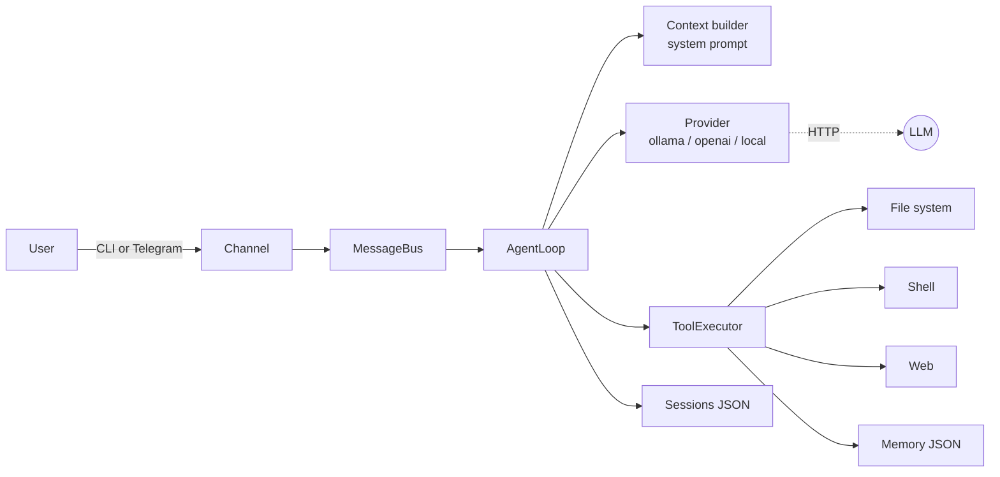
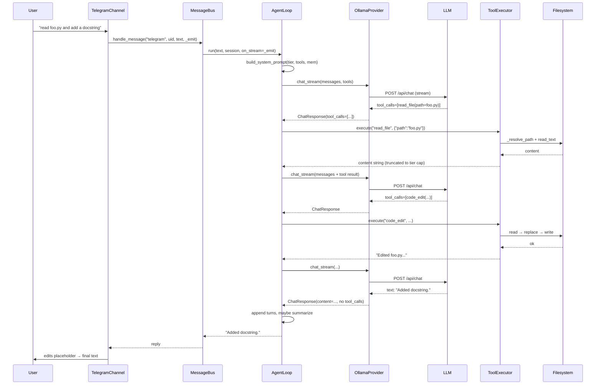

# Agent Mini — Technical Implementation

A deep dive into how Agent Mini is built. The whole codebase is ~3,000 lines of Python, no frameworks (LangChain, LiteLLM, etc.), just `httpx` + `asyncio` + `click` + `rich`. This document explains the moving parts and the design decisions behind each one.

---

## 1. High-Level Architecture

Agent Mini is a **ReAct-style loop** — the LLM thinks, picks a tool, observes the result, and repeats until it returns a text answer. Around that loop we have:

- **Providers** — pluggable LLM backends (Ollama, OpenAI, any OpenAI-compatible server).
- **Tools** — shell, files, web, memory. Extensible via plugin drop-ins.
- **Channels** — how the user talks to the agent (CLI REPL, Telegram).
- **Bus** — routes a `(channel, user_id)` pair to its own conversation history.
- **Sessions** — JSON-backed conversation persistence, auto-saved every turn.
- **Config / Memory** — JSON files under `~/.agent-mini/`.



Source map:

- Loop and prompt: [src/agent_mini/agent/loop.py](../src/agent_mini/agent/loop.py), [src/agent_mini/agent/context.py](../src/agent_mini/agent/context.py)
- Tools: [src/agent_mini/agent/tools.py](../src/agent_mini/agent/tools.py)
- Providers: [src/agent_mini/providers/base.py](../src/agent_mini/providers/base.py), [ollama.py](../src/agent_mini/providers/ollama.py), [local.py](../src/agent_mini/providers/local.py)
- Channels: [src/agent_mini/channels/telegram.py](../src/agent_mini/channels/telegram.py)
- Bus + sessions: [src/agent_mini/bus.py](../src/agent_mini/bus.py), [src/agent_mini/sessions.py](../src/agent_mini/sessions.py)
- CLI: [src/agent_mini/cli.py](../src/agent_mini/cli.py)
- Config: [src/agent_mini/config.py](../src/agent_mini/config.py)
- Memory: [src/agent_mini/agent/memory.py](../src/agent_mini/agent/memory.py)
- Vision: [src/agent_mini/agent/vision.py](../src/agent_mini/agent/vision.py)
- Model tiers / token estimator: [src/agent_mini/agent/token_estimator.py](../src/agent_mini/agent/token_estimator.py)

---

## 2. Startup & Wiring

The `agent-mini` command is a Click group defined in [src/agent_mini/cli.py](../src/agent_mini/cli.py). Sub-commands:

| Command | What it does |
|---|---|
| `init` | Interactive wizard → writes `~/.agent-mini/config.json` |
| `chat [-m MSG] [-s SESSION] [--workspace DIR] [--provider P] [--model M] [--yes] [--no-stream] [--show-thinking]` | Single-shot or REPL |
| `gateway` | Starts the Telegram bot |
| `doctor` | Health check of config, provider, model and tools (see §12) |

The chat command wires everything together in `_chat()`:

```
load_config → create_provider → Memory(...) → AgentLoop(provider, config, memory)
             → agent.detect_model() → resume/create session
             → REPL loop → agent.run(...) → save_session(...)
```

On a terminal the reply streams: `_TurnView` shows a spinner while waiting, switches to a Rich `Live` Markdown view when deltas arrive (thinking dimmed above it with `--show-thinking`), freezes the streamed text when a tool starts, and pauses for approval prompts. Off a terminal (pipes, evals) nothing streams and the reply is printed once.

The `--workspace` flag (and `AGENT_MINI_WORKSPACE` env var) overrides `config["workspace"]` and forces `restrictToWorkspace: true`. This is what the [evals harness](../evals/README.md) uses to sandbox each task into a temp dir without touching the user's real config.

---

## 3. The Agent Loop

Everything runs through `AgentLoop.run()` in [loop.py](../src/agent_mini/agent/loop.py).

### 3.1 Per-turn flow

1. Rebuild the system prompt every turn (date, workspace, project instructions, recent memories, model tier). It changes only when the date or memories change, so local servers can reuse their KV cache.
2. Prepend system prompt to the persisted `conversation`, append the new user turn.
3. If the user message contains image references (paths or URLs), the user turn becomes an OpenAI-style multi-part `content` list — see [vision.py](../src/agent_mini/agent/vision.py).
4. Enter an iteration budget (default from tier; user override in `config["agent"]["maxIterations"]`).

Inside each iteration:

```
prune to budget  →  call provider (with retry+jitter)
                 →  no native tool_calls? try parse_text_tool_calls() on the text
                 →  if tool calls: exec in parallel, append tool msgs, check for loops, continue
                 →  else: return text, persist turn (+ tool trace), maybe summarize history, done
```

If the budget runs out, one more call is made with `tools=None` asking the model to summarize what it did and what is left; that summary plus `[Stopped: reached max iterations (N) before finishing.]` is the reply (`finish_reason = "max_iterations"`, exit code 2).

Per-run state (tool trace, loop signatures, nudge count) lives in local variables, so concurrent gateway users can't mix it up.

### 3.2 Retry with jitter

`_call_provider_with_retry` retries on transient errors (HTTP 429/500/502/503/504, `ConnectError`, `RemoteProtocolError`, `ReadError`) up to 3 times with exponential backoff plus random jitter: `wait = 2**attempt + random.uniform(0, 1)`. Read timeouts are not retried (a model that took 300 s will do it again), and nothing is retried once streamed text has reached the user, since that would show it twice. Non-transient errors fail through as an error string; the turn is still recorded.

### 3.3 Parallel tool execution

When the LLM returns multiple tool calls in one response, they're dispatched concurrently with `asyncio.gather`, tagged with `tool_call_id`, and appended in order:

```python
results = await asyncio.gather(*[self._run_tool(tc, on_tool_event) for tc in calls])
```

Each result is truncated to the **tier-specific output limit** (tiny 2 KB, small 4 KB, medium 8 KB, large 20 KB, cloud 50 KB) with a head+tail split so the model sees both ends (for `read_file` the marker suggests `offset`/`limit`). If a tool returned `Error: ...`, the message is postfixed with a self-reflection nudge:

> [The tool call failed. Analyze what went wrong and try a different approach.]

### 3.4 Loop / repetition detection

Each call's signature is `json.dumps([name, args, result[:500]])`, so "same call, same result" is what counts as a repeat. If the last four signatures match the pattern A-B-A-B (which includes A-A-A-A), the loop appends a nudge:

> You have repeated the same tool call multiple times with the same result. Try a completely different approach.

The second time it happens in a run, the loop stops: one call with `tools=None` asks the model to explain what it tried, and the run ends with `finish_reason = "stuck"` (exit code 4).

### 3.5 Context pruning

`_prune_tool_results` is called every iteration on a **copy** of `messages` (never mutates history). It:

- trims tool results older than the last 3 assistant turns to head+tail at half the tier's output limit (at least 1 000 chars), which also works for the tiny and small tiers whose results are already capped at 2 000 / 4 000 chars,
- then, while the estimated request is over the tier's context budget, replaces the oldest tool results with `[cleared to save context: <tool> output, N chars. Re-run the tool if you need it.]`. The results of the latest round are never cleared.

### 3.6 History summarization

After a text-only response, if the persisted conversation exceeds 75% of the model's effective context, `_summarize_history` fires. It:

1. Finds the cut point that would bring us back below 50%, never past the latest exchange, and moves it back so the kept part starts on a user turn.
2. Calls the provider with a tight summarization prompt (`temperature=0.3`, no tools). Messages are clipped to 500 chars, except an earlier `[Previous context summary]`, which is carried over whole.
3. Replaces the summarized head with a single **`role: "user"`** turn containing `[Previous context summary]\n...`.

Why `user`, not `system`? The real system prompt is re-prepended fresh every turn in `run()`, so a stored `system` entry would give small models two leading system messages and dilute the constraint-first anchoring they rely on.

### 3.7 Token / cost tracking

Two counters live on the loop: `session_usage` and per-turn `turn_usage`, both `{prompt_tokens, completion_tokens, total_tokens}`. Providers surface `usage` on `ChatResponse` when the backend reports it (Ollama's `prompt_eval_count`/`eval_count`, including in streams; OpenAI's `usage`, requested in streams with `stream_options.include_usage`).

### 3.8 Tool trace

Only user messages and final replies are persisted. So later turns know what happened, the saved reply ends with `[tools used: read_file(src/a.py), code_edit(src/a.py)]` (at most 12 entries).

---

## 4. Model-Tier-Aware Tuning

[token_estimator.py](../src/agent_mini/agent/token_estimator.py) is the small-model spine of the project. Model name → tier → different behavior everywhere.

### 4.1 Classification

`classify_model_tier` reads the parameter count from the name (`:8b`, `:0.6b`, `8x7b` counts as 56B, `135m` is tiny). The `(?<![\w.])` lookbehind skips version digits (`qwen2.5`) and active-parameter tags (`30b-a3b` is 30B, not 3B). Names without a size tag are `cloud` when they look like an API model (`gpt-*`, `o3`, `claude*`, `gemini*`, `grok*`, `deepseek-chat`), otherwise `small`. `get_profile()` returns the budgets as a frozen `TierProfile` and honours `agent.tier` / `agent.contextWindow` overrides.

**Detection beats guessing.** At startup (and after `/model`) the CLI and gateway call `AgentLoop.detect_model()`, which asks the provider for a `ModelInfo` (Ollama: `/api/show` → `parameter_size`, `<arch>.context_length`, `capabilities`). A reported size picks the tier; a reported context length caps both the conversation budget and `num_ctx`. A model without the `tools` capability triggers a warning.

**`num_ctx`.** `AgentLoop` sets `provider.context_window = num_ctx_for(profile, tool_defs)`: the conversation budget + tool-schema tokens + 1 024 (system prompt) + 2 048 (reply), rounded up to a multiple of 2 048. The Ollama provider sends it as `options.num_ctx` unless `providers.ollama.numCtx` pins a value. Without it Ollama uses its 2k–4k default and silently cuts the front of the prompt.

| Tier | Effective context | Max iterations | Tool output cap | Memories in prompt |
|---|---|---|---|---|
| tiny (<4B) | 3 000 | 10 | 2 000 chars | 0 |
| small (4–8B) | 6 000 | 15 | 4 000 chars | 3 |
| medium (9–19B) | 12 000 | 20 | 8 000 chars | 5 |
| large (20–72B) | 20 000 | 25 | 20 000 chars | 5 |
| cloud (>72B, API models) | 32 000 | 25 | 50 000 chars | 5 |

### 4.2 What changes per tier

- **System prompt** (`context.py`): tiny models get a stripped `_TINY_RULES` block instead of the full `_SYSTEM_PROMPT_TEMPLATE` — every token trades against reasoning budget.
- **Memory recall in prompt**: see the table. Tiny models get confused by unrelated context.
- **Inline tool listing**: an `<available_tools>` block is always emitted so small models can eyeball tool names without reasoning over the JSON schema.
- **Max iterations, context budget, output cap**: all pulled from the tier tables above unless the user pins a value in config.

### 4.3 Token estimation

Cheap: `~4 chars per token`. Vision image parts count as ~85 tokens each. Tool-call arguments are counted separately. Precise enough to drive the 75% / 50% summarization thresholds.

---

## 5. System Prompt Construction

[context.py](../src/agent_mini/agent/context.py):

```
[tier-scaled preamble + rules]         <- date only, no clock
[<available_tools> ... </available_tools>]
[## User instructions   <- from config.agent.systemPrompt]
[<project_instructions> <- .agent-mini.md or AGENTS.md in the workspace, capped]
[## Recent memories     <- top-N by tier, last because they change most]
```

Anti-injection details worth noting:

- The template uses `str.format(date=..., workspace=...)` — user-controlled fields never go through `.format()`. Custom `systemPrompt` and memory values are string-concatenated, so a stray `{}` from the user won't blow up formatting.
- Memory content and project instructions are appended raw — treat them as effectively user-provided when auditing.
- `web_fetch` / `web_search` output is wrapped in `<untrusted_content source="…">`, and a rule tells the model never to follow instructions found inside it.

---

## 6. Providers

### 6.1 The abstraction

[providers/base.py](../src/agent_mini/providers/base.py) defines:

```python
@dataclass
class ToolCall:  id: str; name: str; arguments: dict

@dataclass
class ChatResponse:  content, tool_calls, thinking, usage

class BaseProvider(ABC):
    async def chat(messages, tools, temperature) -> ChatResponse
    async def chat_stream(messages, on_delta, tools, temperature, on_thinking) -> ChatResponse
```

Providers normalize to `ChatResponse`; the loop is provider-agnostic.

### 6.2 JSON repair for tool arguments

Small models emit malformed JSON. `parse_arguments` first tries `json.loads`, then `_repair_json` which:

1. Strips ``` fences.
2. Drops trailing commas before `}` / `]`.
3. Swaps single→double quotes when there are no doubles.
4. Quotes unquoted keys (`{foo: 1}` → `{"foo": 1}`).

Only successful `dict` results are returned; anything else becomes `{"__invalid_json__": raw}` and the executor answers with an `Error:` asking for valid JSON.

### 6.2b Tool calls written as text

When a response has no native `tool_calls`, `parse_text_tool_calls(content, known_tool_names)` looks for Hermes/Qwen `<tool_call>{…}</tool_call>` tags, Mistral's `[TOOL_CALLS] [...]`, fenced JSON blocks, and a bare `{"name": …, "arguments"|"parameters": …}` message (with an optional `<|python_tag|>` prefix). Only known tool names count, and a fenced block inside a long answer is treated as an example, not a call. Recovered calls are logged (`Recovered N tool call(s) written as text`) and counted in `AgentLoop.text_tool_calls`.

### 6.2c Errors and IDs

`raise_for_status(resp, hint)` reads the error body before raising, so users see the server's message (`model 'x' not found`) plus a hint (`run: ollama pull x`, or "this model has no tool support"). Missing tool-call IDs get a random `call_<12 hex>` instead of a reused `call_0`.

### 6.3 Ollama

[ollama.py](../src/agent_mini/providers/ollama.py) — POSTs to `/api/chat`. Streams NDJSON.

Notable transforms in `_clean_messages`:

- Tool calls use Ollama's native shape: assistant messages keep `tool_calls` with **object** arguments, and results are `{"role": "tool", "tool_name": …}`. Only Ollama builds with native tool messages are supported.
- OpenAI-style multi-part vision content (`[{type: "image_url", ...}]`) is flattened to Ollama's `{content, images: ["<base64>"]}` shape, stripping `data:...;base64,` prefixes when present.
- `think` (`false | true | "low" | "medium" | "high"`) is passed through unchanged; thinking deltas are streamed via a separate `on_thinking` callback.

The payload carries `options.num_ctx` (see §4.1) and `keep_alive` when configured. Streaming collects tool calls from every chunk (newer builds split them) and reads usage from the final `done` chunk.

### 6.4 OpenAI-compatible (`LocalProvider`)

[local.py](../src/agent_mini/providers/local.py) — plain `/chat/completions` client. Subtleties:

- Streaming tool calls arrive in fragments indexed by `tc["index"]`. We accumulate them in a dict, then sort by that **integer** index — not by `id` (opaque string) which would sort `"call_10"` before `"call_2"` lexicographically.
- Arguments arrive as string fragments concatenated across chunks; we run the full string through `parse_arguments` (repair-aware) at the end.
- SSE lines are accepted as `data: {…}` and `data:{…}`; streams request `stream_options.include_usage` and read the usage-only final chunk.
- `reasoning_content` (vLLM, llama.cpp, DeepSeek) becomes `ChatResponse.thinking` and streams through `on_thinking`.

### 6.5 OpenAI

There is no OpenAI class: `create_provider` builds a `LocalProvider` with `base_url = https://api.openai.com/v1` and `name = "openai"`. OpenAI *is* the reference implementation of its own protocol.

---

## 7. Tools

All in [tools.py](../src/agent_mini/agent/tools.py). Tool definitions use the OpenAI function-calling JSON shape:

```python
{"type": "function", "function": {"name": ..., "description": ..., "parameters": {...}}}
```

### 7.1 Built-in tools

Registered in `_TOOLS`. Tools return their full output; the loop cuts it to the tier's output limit (head + tail) in one place:

| Tool | Notes |
|---|---|
| `shell_exec` | Runs via `asyncio.create_subprocess_shell` inside workspace `cwd` in its own process group, with secret-looking env vars (`KEY`, `TOKEN`, `SECRET`, `PASSWORD`, `CREDENTIAL`) removed unless listed in `tools.shellEnvAllow`. On timeout (`tools.shellTimeout`, default 120 s) the whole group is killed. A non-zero exit appends `[exit code: N]` (no `Error:` prefix, since `grep` exits 1 on no match). Blocklist regex enforced. |
| `read_file` | UTF-8 text; optional `offset`/`limit` line range with a `[lines a-b of n]` header; files with a NUL byte in the first 8 KB are reported as binary. |
| `write_file` | UTF-8 text; parent dirs created. |
| `code_edit` | Exact single-match find-and-replace first. If that finds nothing, a line-by-line match that ignores leading/trailing whitespace is tried, and the new text is re-indented to the file's indentation. CRLF files stay CRLF; non-UTF-8 files are refused rather than corrupted. Success shows the edited lines with 2 lines of context; failure shows the closest match (difflib, ≥ 60 % similar). |
| `list_directory` | Sorted, directories first, capped at 200 entries with `… and N more entries`. |
| `find_files` | Glob search via `os.walk`, skipping `.git`, `node_modules`, `.venv`, caches. `*.py` matches at any depth; results are workspace-relative, sorted, capped at 200. |
| `search_files` | Prefers `rg` (ripgrep) with `--hidden`, skipping `.git`, `node_modules` and `.venv`; falls back to `grep -rnI`. Uses `-e <query> --` so a pattern starting with `-` isn't read as a flag. Paths are workspace-relative, 30 s timeout. `returncode` 0 or 1 both count as success (1 = no matches). |
| `web_search` | POSTs to the DuckDuckGo lite / HTML endpoints; parses result blocks with regex; unwraps DuckDuckGo redirect `uddg` param; returns top 8 as Markdown inside `<untrusted_content>`. |
| `web_fetch` | SSRF-guarded per redirect hop, streamed with a 2 MB cap, HTML → plain text via a stdlib `HTMLParser` subclass, wrapped in `<untrusted_content>`. |
| `memory_store` / `memory_recall` / `memory_forget` | See section 8. |

### 7.2 SSRF guard

`_check_url_ssrf` (async) enforces:

- scheme in `{http, https}`,
- literal IPs must not be private/loopback/link-local/reserved,
- host names are resolved via `loop.getaddrinfo` (no blocking DNS on the event loop) and every returned `A`/`AAAA` record is checked — catches DNS names pointing into RFC-1918.

Redirects are followed by hand (at most 5 hops) and every `Location` is checked **before** it is requested, so a 302 into `169.254.169.254` never fires. Documented caveat: DNS rebinding can still bypass — `sandboxLevel: readonly` is the stronger guarantee.

### 7.3 Shell command blocklist

Default patterns:

```
\brm\b(?=…-r|--recursive)(?=…-f|--force)   rm with recursive + force flags, any order
\bsudo\b                    privilege escalation
\bmkfs\b                    filesystem format
\bdd\s+if=                  raw disk write
:\(\)\s*\{                  fork bomb
\b(chmod|chown)\s+...\s+/$  root permission change
```

`tools.blockedCommands` extends (not replaces) the defaults. README calls this out honestly: **friction, not a boundary** — a determined shell caller can bypass. Don't run the agent against untrusted input and expect the blocklist to save you.

### 7.4 Sandbox levels

`config.tools.sandboxLevel`:

- `unrestricted` — all tools, all paths.
- `workspace` (default) — all tools, but `_resolve_path` refuses anything outside `config.workspace`.
- `readonly` — hides and hard-blocks `shell_exec`, `write_file`, `code_edit`. Read, search, memory, and web tools still work, restricted to the workspace.

Any other value raises `ValueError` in `ToolExecutor.__init__` (case is ignored), which the CLI reports as a config error. Before dispatch, `execute()` also checks the call against the tool's schema: unknown tools, missing required arguments and unparseable JSON arguments come back as `Error:` messages that say what to send instead.

Path resolution: `_resolve_path` expands `~`, resolves absolute paths, joins relative paths to the workspace, and in restricted mode raises `PermissionError` if the resolved path is not `is_relative_to(workspace)`. The tool exception handler catches this and returns `Error: PermissionError: ...` to the model.

### 7.4b Approval mode and undo

Tools listed in `tools.confirm` go through `ToolExecutor.approver`, an async `(name, arguments) -> bool` callback, after argument validation and before dispatch. With no approver (the gateway), those tools are denied with an `Error:` telling the model to explain instead. The CLI's approver pauses the spinner/stream and asks `[y]es / [N]o / [a]lways / [d]iff`; `d` prints `preview_change()`, a unified diff computed without writing. `chat --yes` empties the list; a non-interactive run without `--yes` gets EOF and denies.

Before `write_file` or `code_edit` writes, `_checkpoint()` stores the file's previous bytes (or "did not exist") on an in-memory stack of 50. `/undo` pops it: restore the bytes, or delete a file the agent created. `shell_exec` changes are not covered.

### 7.5 Plugins

`_load_plugins()` scans `~/.agent-mini/plugins/*.py`, `importlib.util.spec_from_file_location` each one, and looks for a `TOOL_DEF` dict and `handler` callable (sync or async — the executor `await`s it if it's a coroutine). Plugin definitions get concatenated onto `get_tool_defs()` and dispatched from the `_` case of the `execute()` match.

```python
# ~/.agent-mini/plugins/timestamp.py
TOOL_DEF = {
    "type": "function",
    "function": {
        "name": "get_timestamp",
        "description": "Get current UTC timestamp.",
        "parameters": {"type": "object", "properties": {}, "required": []},
    },
}
async def handler(arguments: dict) -> str:
    from datetime import datetime, timezone
    return datetime.now(timezone.utc).isoformat()
```

No registration, no manifest — drop the file, restart the agent. Plugins can't shadow a built-in name, and in the `readonly` sandbox only plugins whose `TOOL_DEF` has `"x-readonly": true` are loaded (the flag is stripped before the definition is sent to the provider). The plugin directory follows `AGENT_MINI_HOME`.

---

## 8. Persistent Memory

[memory.py](../src/agent_mini/agent/memory.py) — a JSON file at `~/.agent-mini/memory.json`, list of `{key, value, timestamp}`.

### 8.1 Storage

`store()` replaces any entry with the same key (case-insensitive) and appends the new one, trims to `maxEntries` from the tail, and rewrites the file atomically with `0600` permissions. `forget(key)` deletes by key. Corrupted JSON → the file is moved aside to `memory.json.corrupt` and the store starts fresh (never fatal).

### 8.2 Recall — hand-rolled TF-IDF

No embeddings, no vector DB. `recall(query)` does:

1. **Tokenize + stem** — regex `[a-z0-9]+`, then a compact Porter-style suffix stripper that catches common inflections (`-ing`, `-ment`, `-ness`, `-ies`→`y`, `-es`, `-ed`, `-ly`, `-s`, plus ~15 more complex rules like `-ational` → `-ate`).
2. **IDF**: `log((N+1)/(df+1)) + 1` per query term.
3. **Score each doc**: sum of `(tf/doc_len) * idf` for exact term hits, plus a substring-fallback bonus of `0.3 * idf/doc_len` for partial matches (so `python` matches `pythonic`).
4. Return top 10 sorted by score, formatted as `[timestamp] key: value`.

That's it — no external deps, works fine for the hundreds-of-entries scale a personal agent hits.

### 8.3 Prompt integration

`Memory.get_recent(n)` returns the tail of the store; the context builder inlines them into the system prompt under `## Recent memories` (0/3/5/5 by tier). Manual recall via the `memory_recall` tool is the fuzzy-search path.

---

## 9. Sessions

[sessions.py](../src/agent_mini/sessions.py) — JSON files at `~/.agent-mini/sessions/<id>.json`:

```json
{
  "id": "20260728_143022",
  "updated": "2026-07-28T14:30:22.123456",
  "metadata": {},
  "conversation": [ ...role/content dicts... ]
}
```

`save_session` is called after every REPL turn and after `chat -m` (see `_chat` in cli.py); writes are atomic and `0600`. IDs are `YYYYMMDD_HHMMSS_<4 hex>` so two terminals never collide, and any ID that isn't `^[\w-]+$` is rejected (no path traversal). `list_sessions` returns all files sorted newest-first with a computed preview of the first user message. `/load <id>` replaces the in-memory `conversation` list.

---

## 10. Channels & Bus

### 10.1 MessageBus

[bus.py](../src/agent_mini/bus.py) is thin. It maintains an in-memory dict keyed by `f"{channel}:{user_id}"` mapping to the conversation list, and calls `agent.run()` under a per-session `asyncio.Lock`, so two quick messages from one user run one after the other while different users run concurrently.

The gateway also turns memory off when more than one user can reach the bot (unless `channels.telegram.sharedMemory: true`), sets `agent.allow_local_images = False`, and has no approver, so `tools.confirm` tools are denied.

### 10.2 Telegram channel

[telegram.py](../src/agent_mini/channels/telegram.py) uses `python-telegram-bot ≥ 21`. Highlights:

- **Allowlist**: `allowFrom` is a set of user IDs or usernames; `"*"` disables the check.
- **Typing indicator** via `send_action("typing")` at the start of each message.
- **Streaming**: sends an initial `"..."` placeholder and edits it in place. `_flush` debounces edits (min 0.7 s between updates unless ≥80 new chars). It also short-circuits when the preview is unchanged, avoiding Telegram's `message is not modified` error.
- **Chunking**: replies longer than 4 000 chars are split (Telegram's message limit is 4 096).

`agent-mini gateway` iterates over enabled channels and calls `start(bus.handle_message)`. Currently only Telegram is implemented, but the `BaseChannel` interface makes adding new ones cheap.

---

## 11. Vision

[vision.py](../src/agent_mini/agent/vision.py) scans the user message for words that look like image paths (`.png/.jpg/.jpeg/.gif/.webp/.bmp`) or `https?://…\.png` URLs. If any are found, the user message becomes an OpenAI-style multi-part list:

```python
[
  {"type": "text", "text": "what is in this image?"},
  {"type": "image_url", "image_url": {"url": "data:image/png;base64,..."}}
]
```

- Local files are base64-encoded with the correct MIME type. Relative paths resolve against the workspace, files over 10 MB are ignored, and `allow_local=False` (the gateway) ignores local paths entirely.
- Remote URLs are passed through unmodified.
- The Ollama provider translates this shape into its native `{content, images: [...]}` in `_clean_messages`, so the same message works on all three providers.

---

## 12. Configuration

[config.py](../src/agent_mini/config.py) loads the JSON config as a plain dict. Defaults live where each value is read (`cfg.get(key, default)`), and `init` writes only the choices you make, so the code stays the one source of defaults.

Key paths (all under `~/.agent-mini/` by default, or `$AGENT_MINI_HOME`):

| Path | Purpose |
|---|---|
| `config.json` | User config (`0600`) |
| `workspace/` | Default tool sandbox root |
| `memory.json` | Persistent memory store (`0600`) |
| `plugins/*.py` | User tool plugins |
| `sessions/*.json` | Saved conversations (`0600`) |

Runtime overrides: `--workspace <dir>` and `AGENT_MINI_WORKSPACE` env var (used by the evals runner to isolate each task), `AGENT_MINI_HOME` for the whole home directory. Secrets fall back to `AGENT_MINI_API_KEY` / `OPENAI_API_KEY` / `TELEGRAM_BOT_TOKEN` when the config leaves them empty.

`agent-mini doctor` checks the config (JSON validity, permissions, sandbox and tier values), the workspace, provider reachability, whether the model is pulled and supports tools (Ollama), the resulting budgets and `num_ctx`, ripgrep, and the Telegram setup. It exits 1 when any check fails.

---

## 13. Evals Harness

[evals/](../evals/) is a framework-free task runner. Each TOML task under `evals/tasks/` (parsed with stdlib `tomllib`) describes:

- fixtures to copy into a temp workspace,
- a prompt to send to the agent,
- shell checks with `expect_exact` / `expect_regex` / substring matchers (`{python}` expands to the harness interpreter),
- `fixture_unchanged` paths the agent must not modify.

`evals/run.py` runs `agent-mini chat -m … --yes` with `--workspace` pointing at that temp dir, `--provider/--model` passed through, and `AGENT_MINI_HOME` set to a throwaway home whose config holds only the user's provider settings (memory off, no system prompt, plugins or sessions). It maps the exit code to a failure reason (`max_iterations`, `provider_error`, `stuck`, `timeout`), and writes a JSON report under `evals/results/`. `--compare results/*.json` prints a cross-model table. This is what lets tier-scaling changes be measured rather than intuited.

---

## 14. Error Handling & Observability

- **Provider errors**: transient → retry with jitter; permanent → the loop returns `f"Error communicating with LLM: {e}"` as the final text, and the turn is recorded as `[No reply: the model provider failed.]` plus the tool trace.
- **Tool errors**: caught in `execute()`, returned as `Error: {type}: {msg}`. The loop postfixes the self-reflection nudge so the model retries with a different approach.
- **Max iteration exhaustion / loops**: a final tool-less call produces a summary; the turn is persisted with a `[Stopped: …]` marker so the next turn doesn't have amnesia about what happened.
- **Cancellation**: in the REPL each turn runs as a task with a SIGINT handler that cancels it, so Ctrl+C stops the turn and returns to the prompt.
- **Logging**: `logging.getLogger("agent-mini")`. `-v/--verbose` on `chat` / `gateway` flips to DEBUG. Tool calls and results log at DEBUG; JSON repairs, text tool-call recovery and loop nudges log at INFO (the eval harness counts them).

---

## 15. Design Decisions Worth Calling Out

- **No agent framework.** No LangChain, no LiteLLM, no Semantic Kernel. Every abstraction is one file long, and there's nothing under the hood that isn't in the repo. If a tuning knob matters, it's a constant at the top of a Python file, not a nested YAML key you have to grep an SDK for.
- **Tier-scaled everything.** The same code runs a `qwen2.5:1.5b` and a `gpt-4o` — but the prompt, iteration cap, output cap, memory budget, and context budget all shift by tier. This is measured, not vibed: [evals/results/](../evals/results/) has runs across `qwen3.5:4b`, `9b`, `27b`.
- **JSON-only persistence.** `memory.json`, `sessions/*.json`, `config.json`. No SQLite, no vector DB. You can `cat`, `jq`, diff, and back up your entire agent state.
- **Provider ↔ loop contract is one dataclass** (`ChatResponse`). Adding a new backend is 100 lines of HTTP client plus a mapping function.
- **Streaming is optional at the loop level** but pushed all the way to the Telegram edit-in-place flow so long tool-heavy responses feel responsive.
- **SSRF + shell blocklist are documented as friction, not boundaries.** Honest security posture — the sandbox level is the real control.

---

## 16. End-to-End Example: "read foo.py and add a docstring"

Sequence for a Telegram user sending this message:



Every arrow above is a real function you can grep for in ~3 000 lines of Python.
